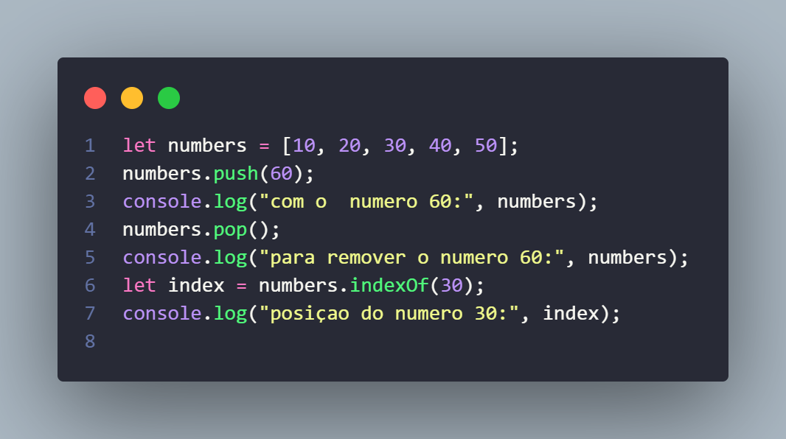
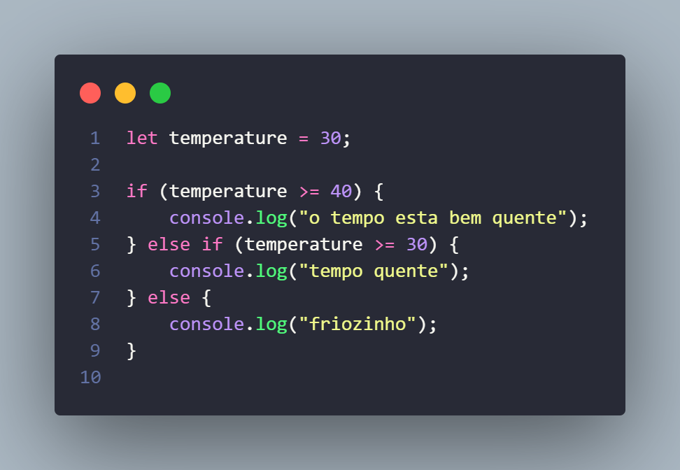
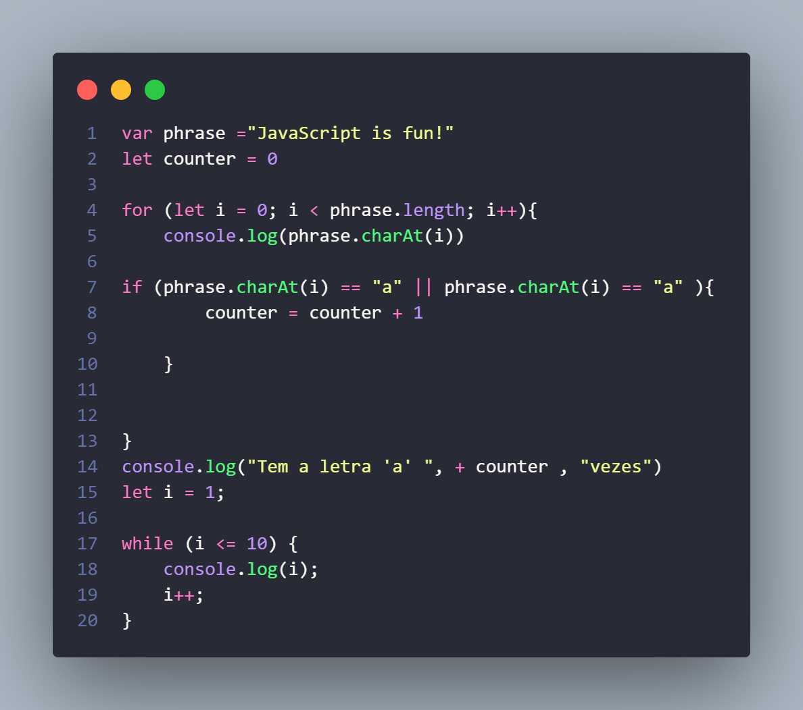
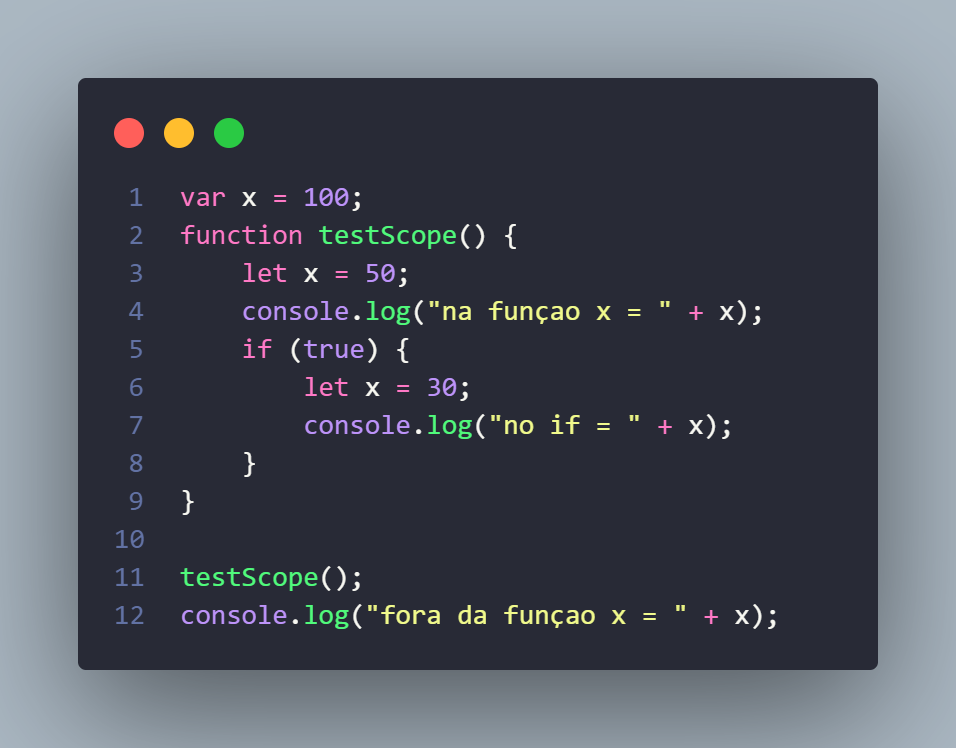

## Exercícios de Introdução ao JavaScript

Este documento contém exercícios básicos de introdução ao JavaScript, abordando conceitos como arrays, condicionais, loops e escopo de variáveis.

# Exercício 1: Manipulação de Arrays

Criar e inicializar um array:
Crie um array chamado numbers com os valores [10, 20, 30, 40, 50].

Adicionar um elemento:
Use o método .push() para adicionar o número 60 ao final do array e imprima o array atualizado no console.

Remover o último elemento:
Utilize o método .pop() para remover o último elemento do array e imprima o array resultante no console.

Encontrar um índice:
Use o método .indexOf() para encontrar a posição do número 30 e imprima essa posição no console.

  

# Exercício 2: Condicionais

Verificar temperatura:
Crie uma variável temperature com um valor numérico à sua escolha.

Estrutura condicional if-else:

Imprima "Está quente!" se o valor de temperature for maior que 30.
Imprima "Está frio!" se o valor de temperature for menor ou igual a 30.
Condição adicional:
Adicione uma condição extra para imprimir "Está muito quente!" se o valor de temperature for maior que 40.

  

# Exercício 3: Loops

Manipular strings com loop for:

Crie uma variável phrase com o valor "JavaScript is fun!".
Use um loop for para imprimir cada caractere de phrase individualmente no console.
Contar caracteres específicos:

Crie uma variável counter para contar quantas vezes a letra 'a' aparece em phrase.
Imprima o valor de counter ao final do loop.
Loop while:
Utilize um loop while para imprimir os números de 1 a 10 no console.

  

# Exercício 4: Escopo de Variáveis

Escopo global:
Declare uma variável x com o valor 100 no escopo global.

Escopo de função:
Dentro de uma função chamada testScope, declare uma variável x com o valor 50 e imprima-a no console.

Escopo de bloco:
Crie um bloco if dentro da função testScope e declare uma variável x com o valor 30, imprimindo-a no console.

Testar escopo global:
Chame a função testScope e, em seguida, imprima o valor de x fora da função para verificar o escopo das variáveis.

  

